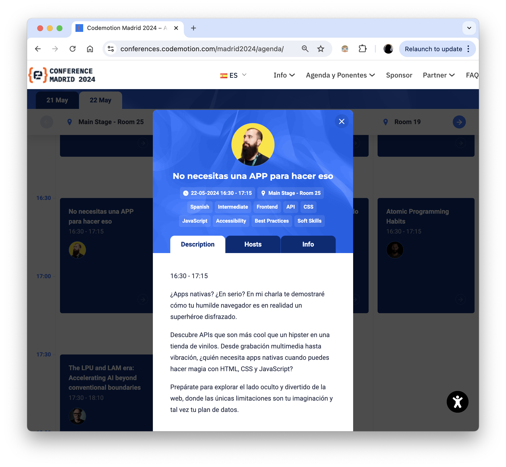

# No necesitas una APP para hacer eso
> 22 de Mayo 2024

## Codemotion Madrid 2024

¿Apps nativas? ¿En serio? En mi charla te demostraré cómo tu humilde navegador es en realidad un superhéroe disfrazado.

Descubre APIs que son más cool que un hipster en una tienda de vinilos. Desde grabación multimedia hasta vibración, ¿quién necesita apps nativas cuando puedes hacer magia con HTML, CSS y JavaScript?

Prepárate para explorar el lado oculto y divertido de la web, donde las únicas limitaciones son tu imaginación y tal vez tu plan de datos.

- https://conferences.codemotion.com/madrid2024/agenda/

- https://x.com/CodemoMadrid/status/1760267511231119545

- Grabación: https://www.youtube.com/watch?v=7-8D80fG3eg
